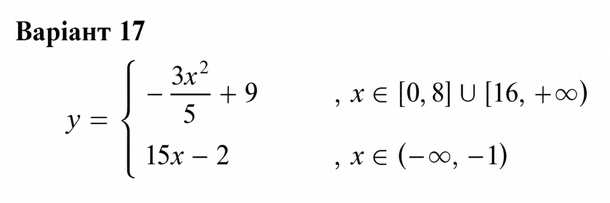
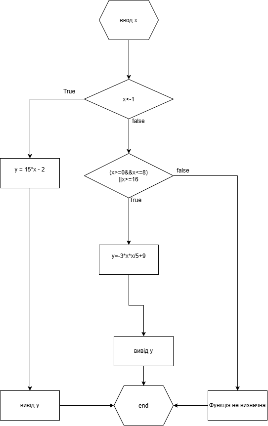

Міністерство освіти і науки України
Національний технічний університет України
«Київський політехнічний інститут імені Ігоря Сікорського»
Факультет інформатики та обчислювальної техніки
Кафедра обчислювальної техніки

Лабораторна робота No1
з дисципліни
«Структури даних і алгоритми»

Виконав: 							Перевірив:
студент групи ІО-64 					Русінов В.В
Педь Валерій Вікторович
номер у списку групи: 17

Київ 2026

Завдання:
Задано дійсне число x. Визначити значення заданої за варіантом кусково-неперервної функції y(x), якщо воно існує, або вивести на екран повідомлення про неіснування функції для заданого x.

Умова:
Розв'язати задачу двома способами (написати дві програми):

1. У програмі дозволяється використовувати тільки одиничні операції порівняння (=, <>, <, <=, >, >=) і не дозволяється використовувати булеві (логічні) операції (not, and, or тощо);
2. У програмі необхідно обов'язково використати булеві (логічні) операції (not, and, or тощо); використання булевих операцій не повинно бути надлишковим.

Діаграма алгоритму програми 1 (без булевих операцій)

Діаграма алгоритму програми 2 (з булевих операцій)

